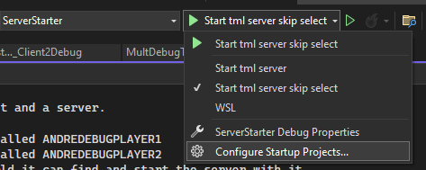
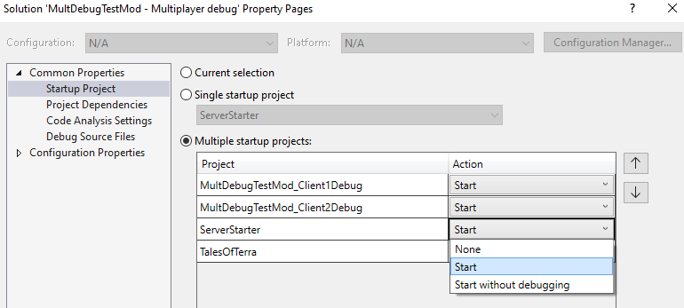

## What is this
There is a project for a client, another client and a server.

- The Client1 project will look for a player called ANDREDEBUGPLAYER1.
- The Client2 project will look for a player called ANDREDEBUGPLAYER2.
- The Server project will select the first world it can find and start the server with it.

## Using this 
For new mods, the .sln file should be edited to target the parent mod. Specifically replace TalesOfTerraMod with your mod's name and fix the path.

The solution file should be opened with an IDE like Visual Studio, then on the debug options, click on Configure Startup Projects.  

Then on 'Common Properties' -> 'Startup Project', select the 'Multiple Startup Projects' option.  
Change the launch settings of every project __except the mod project__ to 'Start' then Accept.  

Then it should look something like this.  

Then just click 'Start' and it should start the 3 at once.  
Do not change the configuration afterwards or its gonna forget the launch settings, use the sln at the mod root to launch the game on singleplayer.

## Why
Launching the projects like this allows for debugging the clients and the server at the same time, Edit and Continue and Hot Reload changes also apply to all at once.  

## Issues
Starting the 3 projects at once is a little intensive for a computer.

##### credits
made by lolqeuide, anderrizzno156543 and the naked man